<p align="center">

</p>

# Env Econ Toolkit

**A browser-based calculator for environmental economics — externalities, pollution abatement, and time-value analysis in one place.**

Built for students, researchers, and practitioners working through environmental economics problem sets, policy analysis, or cost-benefit evaluations. Enter your equations, hit solve, and get publication-ready graphs and step-by-step results — no installs, no spreadsheets, no LaTeX.

🌐 **[Launch the Toolkit →](https://environ-economics-tool.vercel.app/)**

---

## Table of Contents

- [What It Does](#what-it-does)
- [Getting Started](#getting-started)
- [Externality Analysis](#externality-analysis)
- [Abatement Cost Analysis](#abatement-cost-analysis)
- [Time Value Analysis](#time-value-analysis)
- [Loading Data from JSON](#loading-data-from-json)
- [Equation Syntax](#equation-syntax)
- [Example Walkthroughs](#example-walkthroughs)

---

## What It Does

The toolkit is organized into three tabs, each covering a core topic in environmental economics:

| Tab | What You Can Do |
|-----|-----------------|
| **Externality** | Find competitive and efficient equilibria, compute Pigouvian taxes, derive missing cost curves, solve cost-effective abatement allocations, calculate total social benefit, and visualize deadweight loss |
| **Abatement** | Enter a marginal social cost function, specify old and new abatement levels, compute incremental costs, and graph MSC and TSC curves with shaded cost regions |
| **Time Value** | Convert nominal values to real, build present value tables, run benefit-cost analyses with inflation adjustment, compute PVNB, and evaluate single future amounts |

Everything runs client-side in your browser. Nothing is sent to a server.

---

## Getting Started

1. Open **[environ-economics-tool.vercel.app](https://environ-economics-tool.vercel.app/)**
2. Select a tab — **Externality**, **Abatement**, or **Time Value**
3. Enter your equations or data
4. Click an operation button to compute results

No account, no downloads, no setup.

<!-- IMAGE: Annotated screenshot of the three tab buttons (⚖️ Externality, 🏭 Abatement, ⏳ Time Value) highlighted with a callout arrow and label "Click a tab to switch between modules." Show the tabs in their default state with Externality selected (dark background). -->


---

## Externality Analysis

The Externality tab is the most full-featured module. It lets you define a market with supply, demand, and externality curves, then run a variety of operations on them.

### Entering Equations

You'll see input fields for up to eight equations:

| Field | Meaning | Example |
|-------|---------|---------|
| **MSB** | Marginal Social Benefit (demand curve) | `200-2Q` |
| **MPC** | Marginal Private Cost (supply curve) | `20+2Q` |
| **MEC** | Marginal External Cost | `2Q` |
| **MSC** | Marginal Social Cost | Auto-derived as MPC + MEC |
| **MAC_1** | Marginal Abatement Cost, Firm 1 | `4A` |
| **MAC_2** | Marginal Abatement Cost, Firm 2 | `2A` |
| **TAC_1** | Total Abatement Cost, Firm 1 | `2A^2` |
| **TAC_2** | Total Abatement Cost, Firm 2 | `A^2` |

You only need to fill in two of MPC, MEC, and MSC — the toolkit derives the third automatically.

<!-- IMAGE: Screenshot of the Equations card on the Externality tab, showing the eight input fields in a 2-column grid. The fields MSB, MPC, MEC, and MSC should be filled with example values (e.g., MSB: "200-2Q", MPC: "20+2Q", MEC: "2Q", MSC left blank). The MAC and TAC fields can be empty. Show the Total Abatement Standard field below, and the TSB bounds fields at the bottom. -->
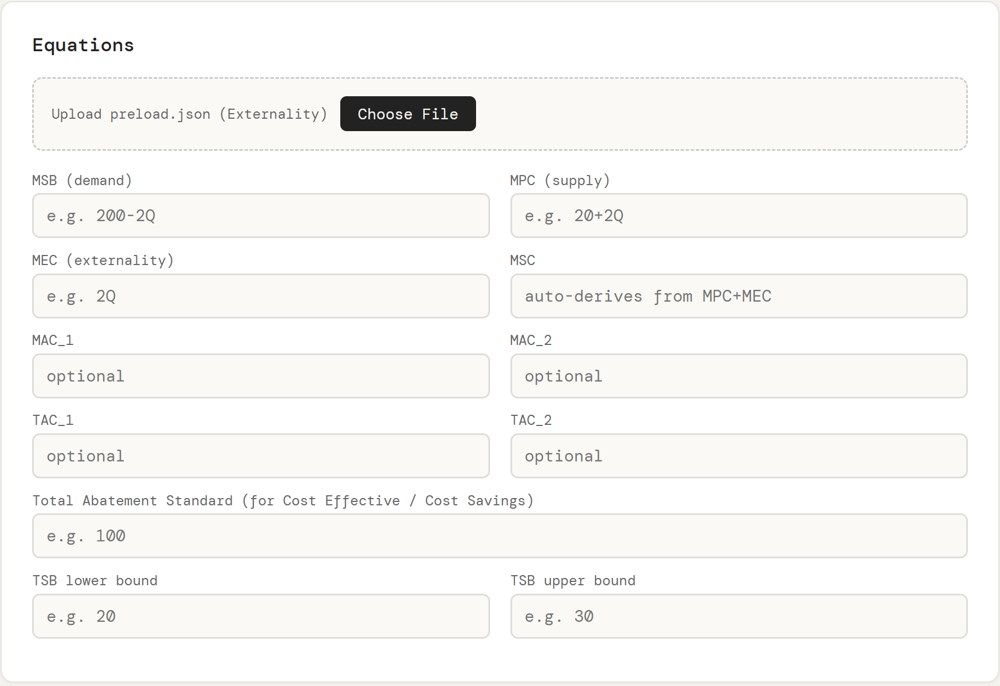

### Operations

Once your equations are entered, the **Operations** card presents a row of buttons. Each button lights up once the required inputs are filled in:

**Derive Missing** — Given any two of MPC, MEC, MSC, the toolkit computes the third and fills it in for you.

**Competitive EQ** — Solves MSB = MPC for the unregulated market equilibrium (Q\*, P\*).

**Efficient EQ** — Solves MSB = MSC for the socially optimal equilibrium.

**Pigouvian Tax** — Finds the efficient quantity, then evaluates MEC at that quantity to give you the optimal per-unit tax.

**Full Solve + Graph** — Runs all of the above at once and renders an annotated graph showing both equilibria, the MSB/MPC/MSC curves, deadweight loss shading, labeled intersection points (W, X, Y, Z), and axis values.

<!-- IMAGE: Screenshot of the "Full Solve" results card AND the graph card together. The results card should show rows like "Competitive Q: 45", "Competitive P: 110", "Efficient Q: 33.33", "Efficient P: 133.33", "Pigouvian Tax: 66.67", etc. Below it, the graph card should show the canvas-rendered externality diagram with labeled MSB (purple), MPC (blue), and MSC (red) curves, shaded deadweight loss triangle, dashed lines to axes, and labeled points W, X, Y, Z with Qe, Qc, Pe, Pc values on the axes. -->
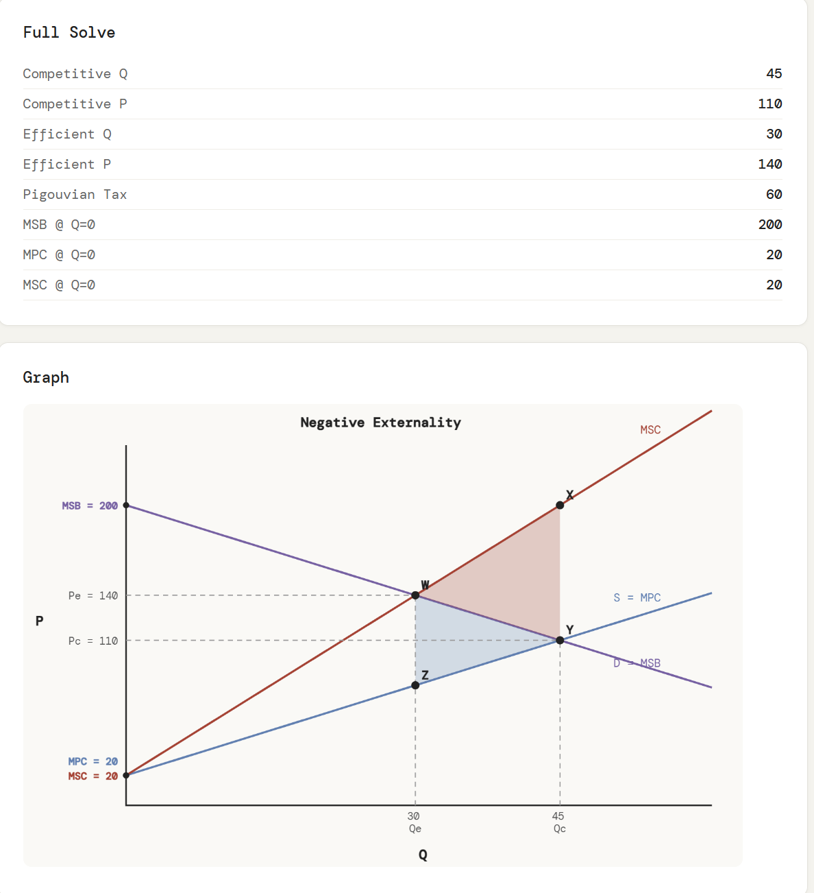

**Cost Effective** — For two firms with different MAC curves and a total abatement standard, finds the cost-minimizing allocation where MAC₁ = MAC₂.

**TSB** — Integrates MSB over a specified quantity range to compute Total Social Benefit.

**Cost Savings** — Compares total abatement costs under optimal (tradeable permit) allocation vs. equal allocation, showing the dollar savings from trading.

### Evaluate Any Equation

Below the operations, the **Evaluate Any Equation** card lets you pick any defined equation from a dropdown and plug in a specific value. For example, select "MEC" and enter Q = 50 to see the externality cost at that quantity.

<!-- IMAGE: Screenshot of the "Evaluate Any Equation" card. Show the dropdown set to "MSB", the Value field set to "50", and the result displayed below: "MSB @ Q=50 = 100". -->
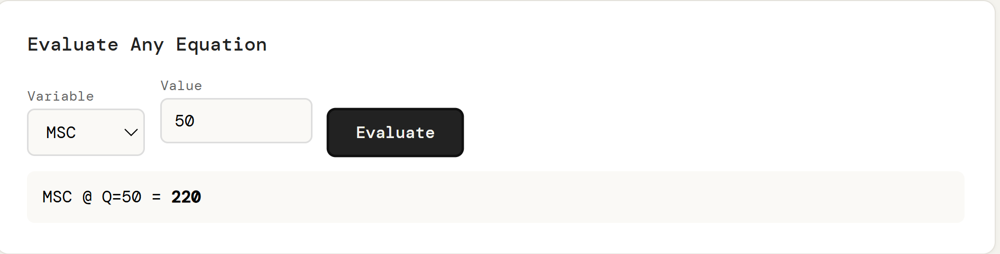

---

## Abatement Cost Analysis

The Abatement tab focuses on marginal and total social cost curves for pollution reduction.

### Inputs

| Field | Meaning | Example |
|-------|---------|---------|
| **MSC equation** | Marginal Social Cost of abatement as a function of A | `4+0.75A` |
| **A_old** | Starting abatement level | `10` |
| **A_new** | Target abatement level | `20` |

### Operations

**Compute Incremental Cost** — Evaluates MSC at both abatement levels, integrates the MSC curve from A_old to A_new, and returns the total cost of moving between the two levels along with the total social cost at each point.

**Graph MSC** — Renders the marginal social cost curve with the area between A_old and A_new shaded, dashed reference lines, and the incremental cost (IC) value labeled inside the shaded region.

**Graph TSC** — Renders the total social cost curve (the integral of MSC from 0 to A) with a right-side bracket showing the incremental cost between the two abatement levels.

<!-- IMAGE: Side-by-side screenshots (or stacked vertically) of the MSC graph and the TSC graph. The MSC graph should show an upward-sloping line labeled "MSC" in red, with a blue-shaded area between A_old and A_new, dashed lines from each point to both axes, and "IC = [value]" labeled inside the shaded area. The title reads "MSC: Incremental Cost". The TSC graph should show a convex curve labeled "TSC" in red, two points on the curve at A_old and A_new, dashed lines extending to a right-side bracket, and "IC = [value]" next to the bracket. The title reads "TSC: Incremental Cost". -->
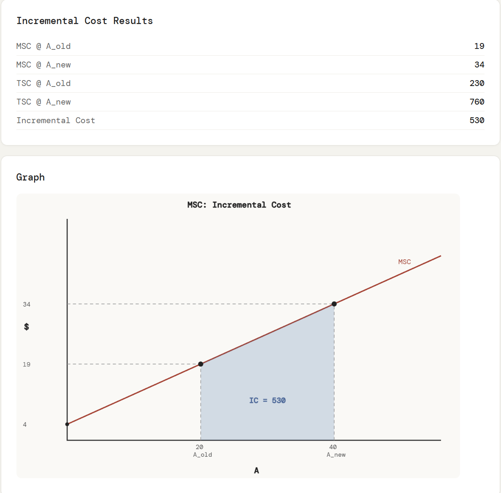

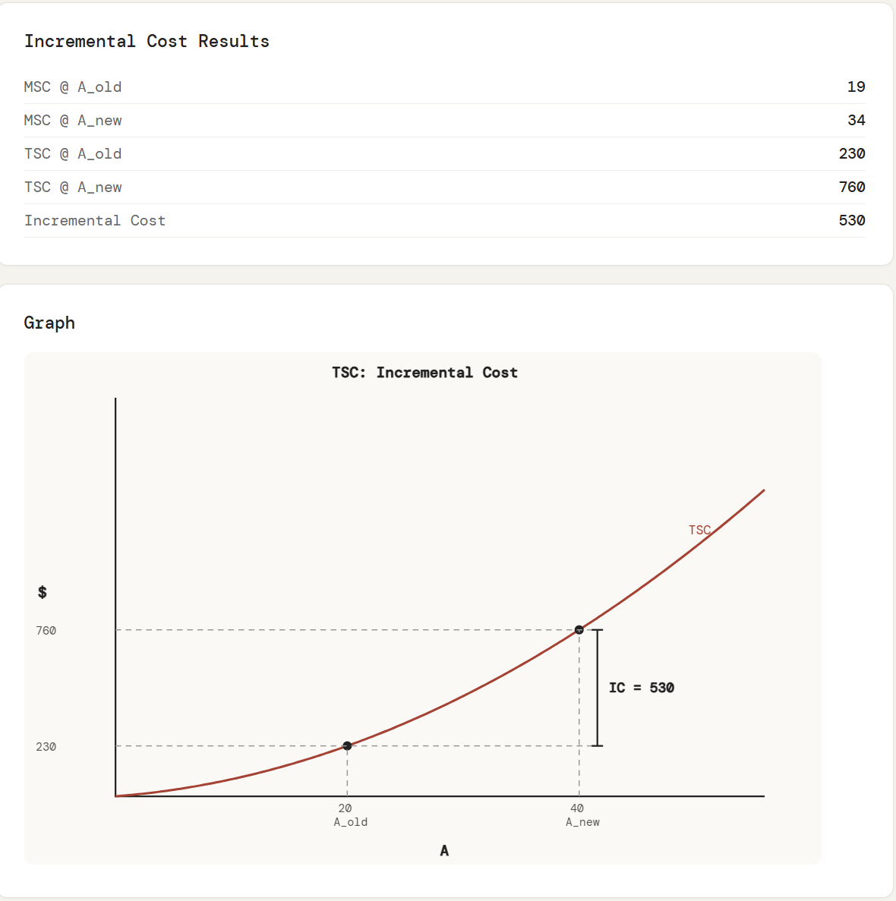

---

## Time Value Analysis

The Time Value tab handles present value calculations, nominal-to-real conversions, and full benefit-cost analysis across multiple years.

### Year Data Table

The top of the tab presents an editable table where each row represents a year. Columns include:

| Column | Purpose |
|--------|---------|
| **Year** | Calendar year (e.g., 2020) |
| **Nominal** | Nominal dollar value for that year |
| **CPI** | Consumer Price Index (used to derive inflation if no rate is given) |
| **NRB** | Net Real Benefits (used for PVNB calculation) |
| **Benefit** | Nominal benefit (for BCA) |
| **Cost** | Nominal cost (for BCA) |

Click **+ Add Year** to append rows. Click the **×** button on any row to remove it.

<!-- IMAGE: Screenshot of the "Year Data" card showing the editable table with 4-5 rows of sample data. For example: Year 2020 / Nominal 1000 / CPI 100, Year 2021 / Nominal 1100 / CPI 105, Year 2022 / Nominal 1200 / CPI 110, etc. Show the "+ Add Year" button below the table. The "×" delete button should be visible on at least one row. -->
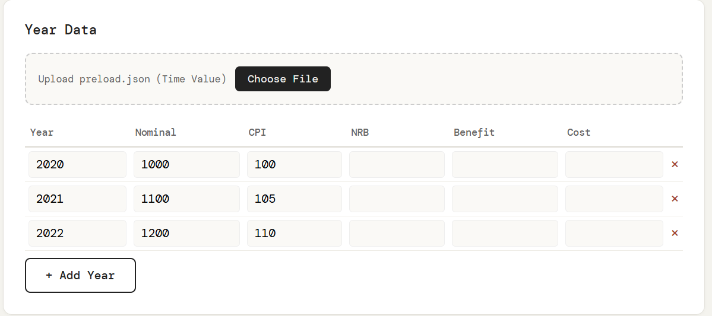

### Parameters

Below the table, set your analysis parameters:

| Parameter | Purpose | Example |
|-----------|---------|---------|
| **Discount Rate (r)** | For present value calculations | `0.10` |
| **Inflation Rate (p)** | For nominal-to-real conversion | `0.05` |
| **Base Year** | Reference year for real values | `2020` |

### Operations

**Nominal → Real** — Converts all nominal values to real (base-year) dollars using either your specified inflation rate or the CPI values in the table. Outputs a table showing each year's real value and the formula used.

**Growth Rate** — After running Nominal → Real, computes the percentage change in real values from the first to the last year.

**PV Table** — Builds a full present value table: adjusts for inflation, applies the discount factor, and sums to a total present value of costs (PVC).

**PVNB** — Discounts the NRB column to compute Present Value of Net Benefits.

**BCA (PVB/PVC)** — Runs a complete Benefit-Cost Analysis. Converts nominal benefits and costs to real, discounts each, and produces total PVB, total PVC, PVNB (= PVB − PVC), and the Benefit-Cost Ratio (BCR). The result card shows a green "Feasible" badge if PVNB > 0 and BCR > 1, or a red "Not Feasible" badge otherwise.

<!-- IMAGE: Screenshot of the Benefit-Cost Analysis results card. Show the table with columns: Year, Nom. Benefit, Nom. Cost, Real Benefit, Real Cost, DF, PV Benefit (green), PV Cost (red). Below the table, show the summary rows: PVB (Total), PVC (Total), PVNB = PVB − PVC, BCR = PVB / PVC. At the bottom, show the green feasibility badge reading "✓ Feasible — PVNB > 0 and BCR > 1". -->
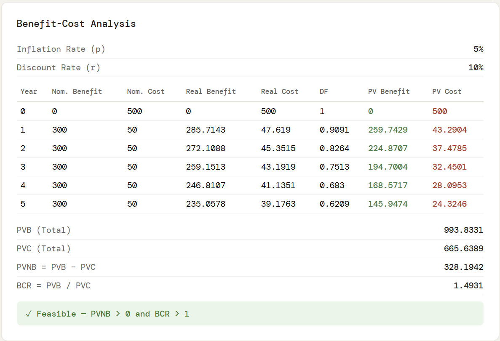

### PV of a Single Future Amount

A standalone mini-calculator at the bottom of the tab. Enter a Future Value, discount rate, and number of periods to compute PV = FV / (1+r)^t. The result shows the formula with your values substituted in.

<!-- IMAGE: Screenshot of the "PV of Single Future Amount" card. Show the three input fields (Future Value: 500, Discount Rate: 0.08, Periods: 3) and the result box below showing "FV: 500", "r: 0.08", "t: 3", and "PV = 500 / (1+0.08)^3 = 396.9161". -->
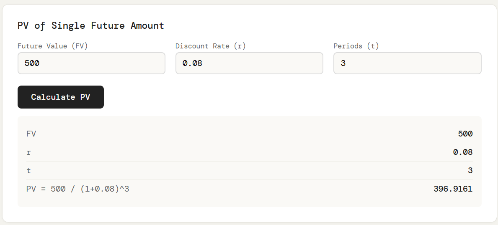

---

## Loading Data from JSON

Every tab supports **JSON file upload** to pre-populate fields. This is useful when you have problem sets saved as structured data or want to quickly switch between different scenarios.

Click **Choose File** on the dashed upload area at the top of any tab's first card and select a `.json` file.

### Externality JSON Format

```json
{
  "variables": {
    "MSB": "200-2Q",
    "MPC": "20+2Q",
    "MEC": "2Q",
    "MAC_1": "4A",
    "MAC_2": "2A",
    "TAC_1": "2A^2",
    "TAC_2": "A^2",
    "total_abatement": 100,
    "tsb_lower": 20,
    "tsb_upper": 30
  }
}
```

Aliases supported: `MPB` maps to MSB, `MAC_MKT` maps to MAC_1.

### Abatement JSON Format

```json
{
  "variables": {
    "MSC": "4+0.75A",
    "A_old": 10,
    "A_new": 20
  }
}
```

### Time Value JSON Format

```json
{
  "variables": {
    "discount_rate": 0.10,
    "inflation_rate": 0.05,
    "start_year": 2020
  },
  "years": {
    "2020": { "nominal": 1000, "CPI": 100, "benefit": 500, "cost": 200 },
    "2021": { "nominal": 1100, "CPI": 105, "benefit": 600, "cost": 250 },
    "2022": { "nominal": 1200, "CPI": 110, "benefit": 700, "cost": 300 }
  }
}
```

<!-- IMAGE: Screenshot showing the JSON upload area — the dashed-border box with the text "Upload preload.json (Externality)" and a dark "Choose File" button. Show a state where a file has been loaded successfully, with the green checkmark and filename "problem3.json" visible next to the button. -->
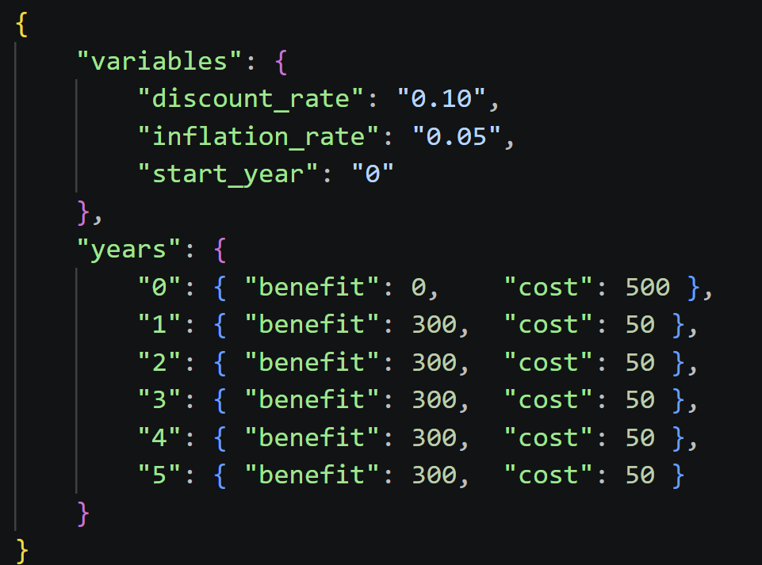

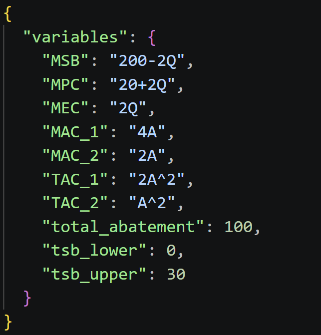

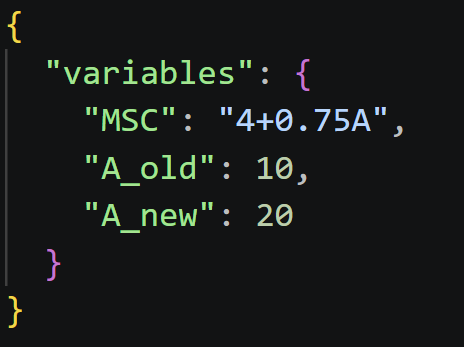

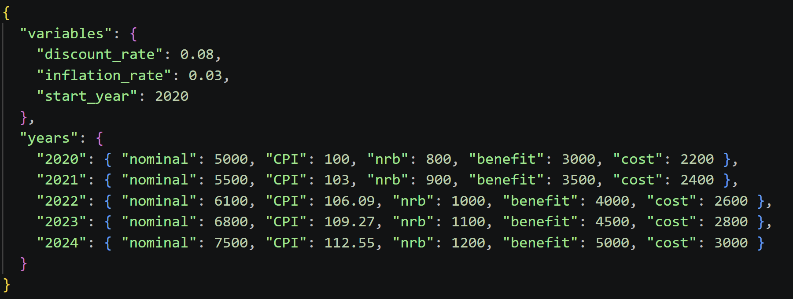

---

## Equation Syntax

The toolkit parses algebraic expressions with the following conventions:

| Syntax | Meaning | Example |
|--------|---------|---------|
| `+`, `-`, `*`, `/` | Arithmetic | `20+2Q` |
| `^` | Exponentiation | `A^2` → A² |
| Implicit multiplication | A number next to a variable | `2Q` → 2×Q |
| Parentheses | Grouping | `(200-Q)/2` |
| `Math.sqrt()`, `Math.log()`, etc. | JavaScript Math functions | `Math.sqrt(Q)` |

The variable name is detected automatically from your expression (e.g., `Q` in `200-2Q`, `A` in `4+0.75A`). You can use any single variable name — the toolkit picks the first non-reserved identifier it finds.

---

## Example Walkthroughs

### Example 1: Negative Externality — Full Market Analysis

**Scenario:** A factory emits pollution. Demand is MSB = 200 − 2Q, private supply is MPC = 20 + 2Q, and the external cost is MEC = 2Q.

1. Go to the **Externality** tab
2. Enter `200-2Q` in MSB, `20+2Q` in MPC, `2Q` in MEC
3. Leave MSC blank — it auto-derives as `(20+2Q)+(2Q)` = 20 + 4Q
4. Click **Full Solve + Graph**
5. Read the results: competitive Q, efficient Q, Pigouvian tax, and a graph with deadweight loss shaded

### Example 2: Cost-Effective Abatement Between Two Firms

**Scenario:** Two firms face MAC₁ = 4A and MAC₂ = 2A. The regulator requires 100 total units of abatement.

1. On the **Externality** tab, enter `4A` in MAC_1 and `2A` in MAC_2
2. Enter `100` in the Total Abatement Standard field
3. Click **Cost Effective** to find each firm's optimal abatement share
4. Optionally enter TAC functions and click **Cost Savings** to compare with equal allocation

### Example 3: Benefit-Cost Analysis with Inflation

**Scenario:** A project spans 2020–2023. You have nominal benefits and costs, inflation is 5%, and the discount rate is 10%.

1. Go to the **Time Value** tab
2. Enter year rows with the Benefit and Cost columns filled in
3. Set Discount Rate to `0.10` and Inflation Rate to `0.05`
4. Click **BCA (PVB/PVC)**
5. Check the feasibility badge — green means the project passes the benefit-cost test

---

<p align="center">
  <sub>Environmental Economics Calculator — Built for academic use</sub>
</p>
